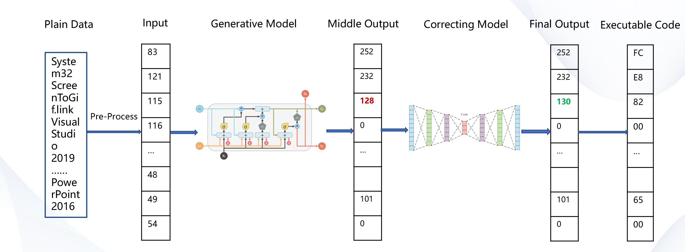
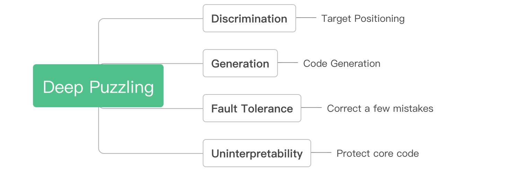
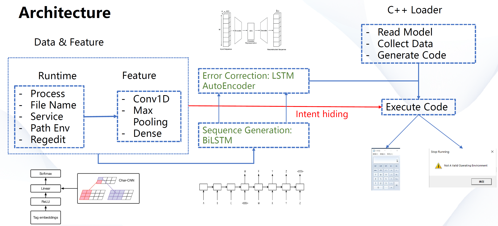
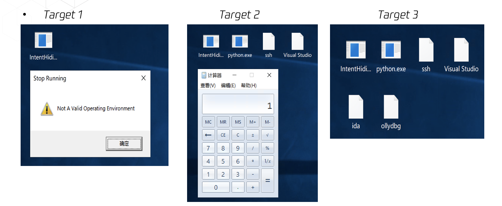
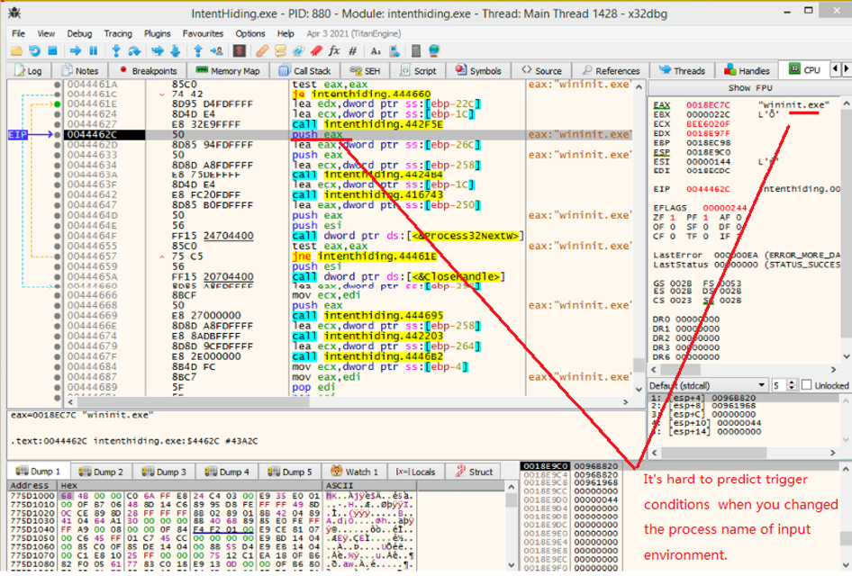

# Deep Puzzling: Binary code intention hiding based on AI uninterpretability

> Deep Puzzling is an AI-based framework for concealing attack intentions and protecting codes, which prevents crackers from obtaining critical codes. The research has be presented at the [HITB+Cyberweek conference 2021](https://cyberweek.ae/2021/presentations/deep-puzzling-binary-code-intention-hiding-based-on-ai-uninterpretability/).
And the Presentation file is available is available here [DeepPuzzling](misc/Deep_Puzzling_Binary_Code_Intention_Hiding_based_on_AI_Uninterpretability.pdf ':include').

## Motivation

As early as 2018, the [DeepLocker](http://i.blackhat.com/us-18/Thu-August-9/us-18-Kirat-DeepLocker-Concealing-Targeted-Attacks-with-AI-Locksmithing.pdf) framework proposed by IBM's Dhilung Kirat and other researchers used neural networks to generat attack key from face image, which showed us the great potential of AI in hiding attack intentions. Following the footsteps of DeepLocker, we further explore the potential of AI algorithms in complex feature modeling, code generation and error correction, and propose the Deep Puzzling framework, an intent hiding tool that can adapt to the current operating environment to generate a variety of dynamic payloads, so as to try to explore the cross-border possibilities of artificial intelligence and cryptography.

## Methods

The core idea of deep puzzling is to avoid explicit conditional judgments in program execution by using AI algorithms, so as to achieve automatic recognition of the target, unlock the corresponding payload, perform the corresponding functions, and finally complete the concealment of the true intention and protect the core code. 

**Key Points**
- Hide your intentions into a bunch of `ordinary data`
- Design a `feature extraction - sequence generation` network and train the first model with the above backdoor data
- Design a `AutoEncoder` error correction network to automatically correct a small number of error bits
- Data enhancement to improve the `robustness` of the model

## Repository 

This repository is a specific application of the Deep Puzzling framework, which demonstrates how to hide three types of intentions: reverse debuggers, general developers, and others. The first two intentions will execute our pre-designed binary code.

The whole project includes three parts: 
- data collection, the code is in the `DataCollector` directory
- model design and training, the code is in the `DeepModel` directory
- code execution, the code is in the `IntentHiding` directory 

In addition, the `bin` directory contains the PE files that have been generated, and the `lib` directory contains the static data collection library, AI model files, and shellcode.

The overall framework diagram is as follows:

### Requirments
- Visual Studio 2019(clang support is optional and suggested)
- Python 3.8
- tensorflow-gpu 2.5.0
- frugally-deep v0.15.12-p0 [Github Release](https://github.com/Dobiasd/frugally-deep/releases/tag/v0.15.12-p0)

### Demonstration

**Hidden intent**
- Target 1： 
    - for ordinary people, execute a MessageBox code
    - Feature: Clean office system
- Target 2: 
    - for developers, execute a Calculator code
    - Feature: Visual Studio、Python、SSH，etc.

**Anti-debugging**
- Target3:  
    - for debuggers, no code execution
    - Feature:  IDA、OllyDbg、WinDbg, etc.

### Analysis

- We do not seek to use any techniques to obfuscate the source code
- It’s not difficult to locate the code that runs the "intent", the difficulty lies in when it will be triggered
- If the ECX value here is not the "input" of our intended purpose, it will be the wrong value, and There will be no payload running
- The “input” we mentioned here is a high-dimensional space vector. It is difficult to infer the real “purpose” simply by modifying some data because of Robustness of AI model

